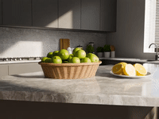
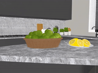
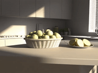
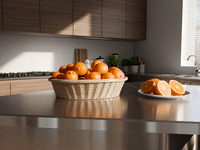
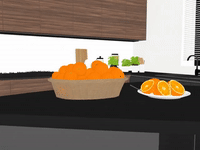
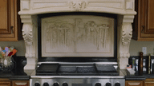

## ___***UniVidX: A Unified Multimodal Framework for Versatile Video Generation via Diffusion Priors***___

<div align="center">
    <a href='https://github.com/houyuanchen111' target='_blank'>Houyuan Chen</a><sup>1</sup>&emsp;
    <a href='https://github.com/Luh1124' target='_blank'>Hong Li</a><sup>2</sup>&emsp;       
    <a href='https://refkxh.github.io/' target='_blank'>Xianghao Kong</a><sup>1</sup>&emsp;   
    <a href='https://github.com/trzhu11' target='_blank'>Tianrui Zhu</a><sup>3</sup>&emsp;
    <a href='https://guoyww.github.io/' target='_blank'>Yuwei Guo</a><sup>4</sup><br>
    <a href='https://hugoycj.github.io/' target='_blank'>Chongjie Ye</a><sup>5</sup>&emsp;
    <a href='https://lllyasviel.github.io/lvmin_zhang/' target='_blank'>Lvmin Zhang</a><sup>6</sup>&emsp;
    <a href='https://sites.google.com/view/fromandto' target='_blank'>Hao Zhao</a><sup>7</sup>&emsp;
    <a href='https://anyirao.com/' target='_blank'>Anyi Rao</a><sup>1,*</sup>
</div>

<div>
<div align="center">
    <sup>1</sup>MMLab, HKUST, &emsp;
    <sup>2</sup>BUAA&emsp;
    <sup>3</sup>NJU&emsp;
    <sup>4</sup>CUHK&emsp;
    <sup>5</sup>FNii, CUHKSZ&emsp;
    <sup>6</sup>Stanford&emsp;
    <sup>7</sup>AIR,THU<br>
</div>
</div>


<p align="center">
  <a href="">
    
  </a>
  <a href="">
    
  </a>
  <a href="">
    
  </a>
  <a href="https://www.apache.org/licenses/LICENSE-2.0">
    
  </a>
</p>


<div align="center">
  
  <br>
</div>


## 📖 Overview

We introduce ***UniVidX***, a unified multimodal video diffusion framework that transcends the boundaries of task-specific models. 
By incorporating Stochastic Condition Masking (SCM), Decoupled Gated LoRA (DGL), and Cross-Modal Self-Attention (CMSA), a single model can achieve versatile video generation and perception. Whether applied to Intrinsic tasks (**UniVid-Intrinsic**) or Alpha channel processing (**UniVid-Alpha**), our approach achieves outstanding performance with remarkable data efficiency (<1k training videos).

---

## 🚀 News
- **[2026/01/04]** Initial release of **UniVidX**.
---

## 🛠️ Installation

```bash
# Clone the repository
git clone https://github.com/your-username/UniVidX.git
cd UniVidX

# Create environment
conda create -n unividx python=3.10
conda activate unividx

# Install dependencies
pip install -r requirements.txt
```

## 🤖 Model Zoo

You can download the weights of backbone Wan2.1-T2V-14B from either **ModelScope** or **Hugging Face**.

**Option 1: ModelScope**
```bash
pip install modelscope
mkdir -p ./checkpoints/Wan-AI
modelscope download Wan-AI/Wan2.1-T2V-14B --local_dir ./checkpoints/Wan-AI/Wan2.1-T2V-14B
```

**Option 2: Hugging Face**
```bash
pip install "huggingface_hub[cli]"
mkdir -p ./models/Wan-AI
huggingface-cli download Wan-AI/Wan2.1-T2V-14B --local-dir ./models/Wan-AI/Wan2.1-T2V-14B
```

Then, download checkpoints of **UniVid-Intrinsic** and **UniVid-Alpha** manually from Hugging Face or let the scripts auto-download them.

| Model Name | Link |
| :--- | :--- |
| UniVid-Intrinsic | 🤗 Download |
| UniVid-Alpha | 🤗 Download |

```bash
TODO
```
---

## 💻 Inference
We use YAML files to centrally manage inference parameters. Below are the configuration templates for **UniVid-Intrinsic** and **UniVid-Alpha**.

#### UniVid-Intrinsic

```yaml
# configs/univid_intrinsic_inference.yaml

experiment_name: "univid_intrinsic_inference"   # Output folder name
mode: "t2RAIN"                                   # Task Mode (One of the 15 supported tasks)

# --- Conditional Inputs ---
# Configure paths based on your chosen 'mode'. Set unused inputs to null.
inference_rgb_path: null
inference_albedo_path: null
inference_irradiance_path: null
inference_normal_path: null

# --- Text Prompt ---
# We recommend using Chinese prompts.
prompt: "一只小刺猬，穿着白色小围裙，头上戴着厨师帽，正站在小凳子上，双手举着一个小平底锅，锅里冒着热气，表情专注而自豪，位于一个现代化的迷你厨房中，不锈钢台面反射着明亮的光线，各种小厨具整齐地排列着, 镜头从右向左移动。"

# --- Model Settings ---
model:
  name: 'UniVidIntrinsic' 
  params:
    # Path to Wan2.1 Backbone
    model_paths: '["models/Wan-AI/Wan2.1-T2V-14B/models_t5_umt5-xxl-enc-bf16.pth", "models/Wan-AI/Wan2.1-T2V-14B/Wan2.1_VAE.pth"]'
    resume_from_checkpoint: "checkpoints/univid_intrinsic.safetensors"
    
    # LoRA Configuration
    lora_base_model: "dit"
    lora_target_modules: "self_attn.q,self_attn.k,self_attn.v,self_attn.o,ffn.0,ffn.2"
    lora_rank: 32
    lora_modalities: ["rgb", "albedo", "irradiance", "normal"]
```

#### UniVid-Alpha

```yaml
# configs/univid_alpha_inference.yaml

experiment_name: "univid_alpha_inference"   # Output folder name
mode: "R2PFB"                                # Task Mode (One of the 15 supported tasks)


# --- Conditional Inputs ---
# Configure paths based on your chosen 'mode'. Set unused inputs to null.
inference_rgb_path: "./assets/R2PFB/bl.mp4"
inference_pha_path: null
inference_fgr_path: null
inference_bgr_path: null

# --- Text Prompt ---
prompt: ""

# --- Model Settings ---
model:
  name: 'UniVidAlpha' 
  params:
    # Path to Wan2.1 Backbone
    model_paths: '["models/Wan-AI/Wan2.1-T2V-14B/models_t5_umt5-xxl-enc-bf16.pth", "models/Wan-AI/Wan2.1-T2V-14B/Wan2.1_VAE.pth"]'
    resume_from_checkpoint: "checkpoints/univid_alpha.safetensors"
    
    # LoRA Configuration
    lora_base_model: "dit"
    lora_target_modules: "self_attn.q,self_attn.k,self_attn.v,self_attn.o,ffn.0,ffn.2"
    lora_rank: 32
    lora_modalities: ["com", "pha", "fgr", "bgr"]
```

Once your YAML configuration is ready, run the corresponding inference script:
```bash
# univid_alpha_inference
python scripts/inference_univid_alpha.py --config configs/univid_alpha_inference.yaml

# univid_intrinsic_inference
python scripts/inference_univid_intrinsic.py --config configs/univid_intrinsic_inference.yaml
```

Below are the 15 tasks (modes) supported by **UniVid-Intrinsic** and **UniVid-Alpha**, along with their corresponding inputs and outputs:

| Task Category | UniVid-Intrinsic | UniVid-Alpha |
| :--- | :--- | :--- |
| **Text $\to$ X** | `t2RAIN` | `t2RPFB` |
| **X $\to$ X** | `R2AIN`, `RA2IN`, `RI2AN`, `RN2AI`, `RIN2A`, `RAN2I`, `RAI2N`, `AIN2R` | `R2PFB`, `RP2FB`, `RF2PB`, `RB2PF`, `FB2RP`, `PFB2R`, `RFB2P`, `RPB2F`, `RPF2B` |
| **Text & X $\to$ X** | `A2RIN`, `I2RAN`, `N2RAI`, `AI2RN`, `AN2RI`, `IN2RA` | `P2RFB`, `F2RPB`, `B2RPF`, `PF2RB`, `PB2RF` |


Different tasks can be combined to enable interesting applications. For example:
### 1. `t2RAIN` $\to$ `IN2RA` (Prompt-driven Video Editing)
<table>
  <tr>
    <td style="border: none; vertical-align: top;">
      <table>
        <tr>
          <td></td>
          <td></td>
        </tr>
        <tr>
          <td></td>
          <td></td>
        </tr>
        <tr>
          <td colspan="2" style="text-align: center; font-weight: bold;">
             "一个开放式的现代极简厨房..."<br>t2RAIN
          </td>
        </tr>
      </table>
    </td>
    <td style="border: none; vertical-align: middle; font-size: 50px; padding: 0 20px;">
      &rarr;
    </td>
    <td style="border: none; vertical-align: top;">
      <table>
        <tr>
          <td></td>
        </tr>
        <tr>
          <td></td>
        </tr>
        <tr>
          <td style="text-align: center; font-weight: bold;">
            "橙子放在不锈钢台上..."<br>IN2RA
          </td>
        </tr>
      </table>
    </td>
  </tr>
</table>

### 2. `R2PFB` $\to$ `PB2RF` (Prompt-driven Video Inpainting)
<table>
  <tr>
    <td style="border: none; vertical-align: top;">
      <table>
        <tr>
          <td></td>
          <td></td>
        </tr>
        <tr>
          <td></td>
          <td></td>
        </tr>
        <tr>
          <td colspan="2" style="text-align: center; font-weight: bold;">
             ""<br>R2PFB
          </td>
        </tr>
      </table>
    </td>
    <td style="border: none; vertical-align: middle; font-size: 50px; padding: 0 20px;">
      &rarr;
    </td>
    <td style="border: none; vertical-align: top;">
      <table>
        <tr>
          <td></td>
        </tr>
        <tr>
          <td></td>
        </tr>
        <tr>
          <td style="text-align: center; font-weight: bold;">
            "带墨镜，穿粉色西装..."<br>PB2RF
          </td>
        </tr>
      </table>
    </td>
  </tr>
</table>

More applications await your exploration.

---

## 🏋️ Training
We utilize `accelerate` for distributed training. The training configurations are provided in `configs/univid_intrinsic_train.yaml` and `configs/univid_alpha_train.yaml`.

Run the following commands to start training:

```bash
# 1. Train UniVid-Intrinsic
accelerate launch --config_file "configs/accelerate_config.yaml" \
    "scripts/train.py" \
    --config "configs/univid_intrinsic_train.yaml"

# 2. Train UniVid-Alpha
accelerate launch --config_file "configs/accelerate_config.yaml" \
    "scripts/train.py" \
    --config "configs/univid_alpha_train.yaml"
```


## 📊 Citation

If you find this work useful, please cite:

```bibtex

```

## 📝 Acknowledgements

Code is built on [DiffSynth-Studio](https://github.com/modelscope/DiffSynth-Studio). Thanks all the authors for their excellent contributions!